# Lenovo Yoga3 Pro **黑苹果安装**
## 前言
#### 安装黑苹果有风险，对于本指南中出现的任何变砖，系统崩溃，冻结，故障，损坏或其他问题，本人不承担任何责任。这样做需要您自担风险。 请认真了解hackintosh相关资料后进行安装操作。  
## 一、机型配置    

|项目|信息|
|:-----:|-----|
|版本信息|Lenovo YOGA 3 Pro-1370/BIOS:A6CN58WW|
|操作系统|Mojave 10.14.3/High Sierra 10.13.6|
|CPU信息|Mobile DualCore Intel Core M-5Y71, 2600 MHz (26 x 100)|
|显示屏幕|Samsung LTN133YL03L01  [13.3" LCD] 3200x1800|
|主板芯片组|Intel Wildcat Point-LP, Intel|
|内存信息|8192MB  (DDR3 SDRAM)|
|显卡信息|Intel(R) HD Graphics 5300(platform-id:0x16260006)|
|硬盘信息|LITEON LGH-512V2G-11 M.2 2280 512GB  (476 GB)|
|网卡信息|Broadcom Bcm94352z|
|声卡信息|Realtek ALC286@ AppleALC layout-id:11|
|触摸设备|i2c触摸板SYNA2B22/i2c触摸屏ATML1000|
|HDMI输出|Intel Broadwell HDMI视屏音频|

## 二、硬件驱动情况        
#### 除了触摸屏不支持多指（单点无手势），其他所有硬件已经完美驱动   

|设备|驱动方法|
|:-----:|-----|
|显卡HD5300|使用[WhateverGreen.kext](https://github.com/acidanthera/WhateverGreen) 注入ig-platform-id 0x16260006 HDMI音视频输出正常|
|声卡ALC286|使用[AppleALC.kext](https://github.com/acidanthera/AppleALC) 注入 layout-id:11 和 [CodecCommander.kext](https://github.com/RehabMan/EAPD-Codec-Commander) 麦克风内外切换正常|
|触摸板|使用核心驱动[VoodooI2C.kext](https://github.com/alexandred/VoodooI2C)+目标驱动VoodooI2CSynaptics.kext(需要修改IOPropertyMatch 为2B22)完美原生手势支持|
|触摸屏|使用核心驱动[VoodooI2C.kext](https://github.com/alexandred/VoodooI2C)+目标驱动VoodooI2CHID.kext仅单点|
|usb设备|使用[OS-X-USB-Inject-All](https://github.com/RehabMan/OS-X-USB-Inject-All) +[SSDT-UIAC-ALL.aml](https://github.com/gdllzkusi/hackintosh--lenovo-Yoga-3-Pro-1370/blob/master/Yoga3%20Pro%EF%BC%88high%20sierra%EF%BC%8910.13.6/%E5%AE%89%E8%A3%85%E5%AE%8C%E6%88%90%E5%90%8E%E4%BD%BF%E7%94%A8EFI%E5%BC%95%E5%AF%BC/EFI/CLOVER/ACPI/patched/SSDT-UIAC-ALL.aml)|
|FN热键|[SSDT-BrightKeyQ38Q39-lenovo.aml](https://github.com/gdllzkusi/hackintosh--lenovo-Yoga-3-Pro-1370/blob/master/Yoga3%20Pro%EF%BC%88high%20sierra%EF%BC%8910.13.6/%E5%AE%89%E8%A3%85%E5%AE%8C%E6%88%90%E5%90%8E%E4%BD%BF%E7%94%A8EFI%E5%BC%95%E5%AF%BC/EFI/CLOVER/ACPI/patched/SSDT-BrightKeyQ38Q39-lenovo.aml)|
|蓝牙WIFI|WIFI使用[SSDT-ARPT.aml](https://github.com/gdllzkusi/hackintosh--lenovo-Yoga-3-Pro-1370/blob/master/Yoga3%20Pro%EF%BC%88high%20sierra%EF%BC%8910.13.6/%E5%AE%89%E8%A3%85%E5%AE%8C%E6%88%90%E5%90%8E%E4%BD%BF%E7%94%A8EFI%E5%BC%95%E5%AF%BC/EFI/CLOVER/ACPI/patched/SSDT-ARPT.aml ) [AirportBrcmFixup](https://github.com/acidanthera/AirportBrcmFixup)  蓝牙使用[BrcmPatchRAM2.kext+BrcmFirmwareData.kext)](https://github.com/RehabMan/OS-X-BrcmPatchRAM) |
|Apple SMC仿真器|使用[OS-X-FakeSMC-kozlek](https://github.com/RehabMan/OS-X-FakeSMC-kozlek) |
|电源管理|使用 [ACPIBatteryManager.kext](https://github.com/RehabMan/OS-X-ACPI-Battery-Driver) |
|SD卡/摄像头|[USB免驱、SD热插拔、速率与Windows功能无差别|

## 三、bios设置  
     *  – Secure Boot → disable  
     *  – Boot MODE → Legacy Support   
     *  – Boot Priority → UEFI First  
     *  –  Intel Virtual Technology → enabled  
     *  – DPTF  → disable   
   
## 四、安装方法    
  1.  下载[系统镜像)](https://mirrors.dtops.cc/iso/MacOS/daliansky_macos/) 使用用[TransMac)](http://7dx.pc6.com/wwb5/TransMac114.zip) 将镜像刻录到U盘  
  2.  使用我的 安装系统使用的EFI（install-EFI）安装系统（无驱动，安装减少报错）   
  4.  第一次使用U盘进去在CLOVER引导界面选择“Boot macOS Install from Install macOS Mojave”安装盘按回车键开始安装，等待跑码结束后进去语言选择界面、然后到 磁盘工具 把你需要安装的硬盘分区 抹除成为APFS格式 名称随便填，抹掉磁盘完成之后回到macOS使用工具界面，选择安装macOS到你刚才抹除的apfs分区。  
  5.  安装过程大概3-5分钟左右，如果你用的不是USB3.0的U盘，那等待时间更多，这个过程主要是把U盘里面的文件拷贝的刚才分区好的硬盘，此时电脑会自动重启，然后选择“Boot macOS Install from MACOS”进行第二阶段安装，注意的是第二阶段安装需要重启两到三次，后面都是选择 “Boot macOS Install from MACOS” 这个选项   
  6.  安装完成后，kext utility 软件 或者  终端  输入 sudo kextcache -i / 重建缓存后关机      
  7.  使用 安装后使用的EFI（安装后使用的EFI）目录下的EFI引导开机进mac      
  8.  此时安装完成系统之后各项驱动已经正常，（如果触摸板无法工作的请查看页面底部最下面说明，触摸板还需要删除两个系统内自带的kext驱动），还存在耳机麦克风切换不正常的问题，下载  [ALC286v1.3.5_Liluv1.3.3_CC_ALCPlugfix.zip](https://github.com/gdllzkusi/hackintosh--lenovo-Yoga-3-Pro-1370/blob/master/ALC286v1.3.5_Liluv1.3.3_CC_ALCPlugfix.zip)  打开ALC286v1.3.5_Liluv1.3.3_CC_ALCPlugfix/ALCPlugFix/目录下双击 install双击自动安装.command 文件 提示输入密码后回车，重启即可。
  9.  详细安装过程请参考 daliansky 写的安装教程   
 [联想小新Air 13黑苹果安装教程](https://blog.daliansky.net/Lenovo-Xiaoxin-Air-13-macOS-Mojave-installation-tutorial.html)
10.  clover生成自己的SN码；  
     *  使用clover configuration挂载EFI分区  
  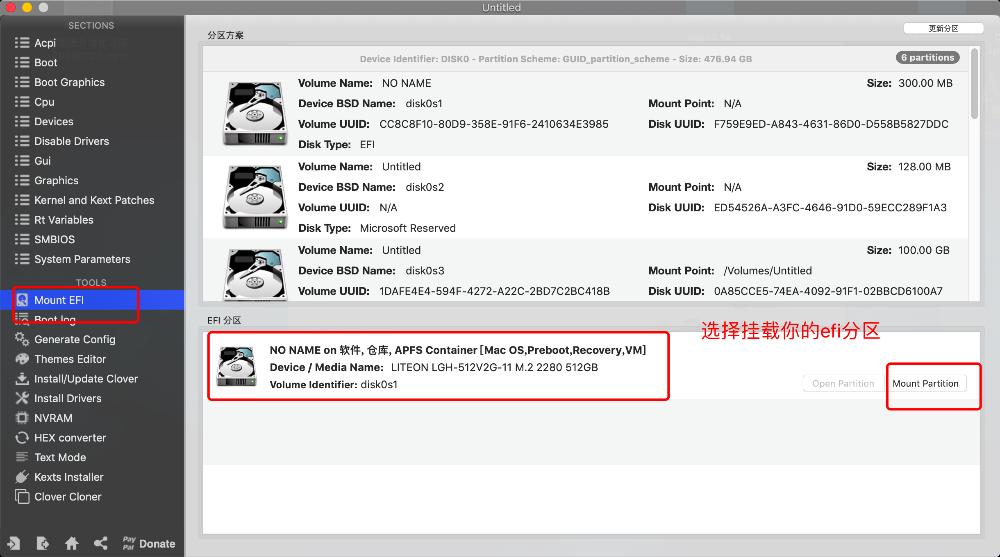
     *  使用clover configuration打开EFI/CLOVER/目录下的config.plist文件  
 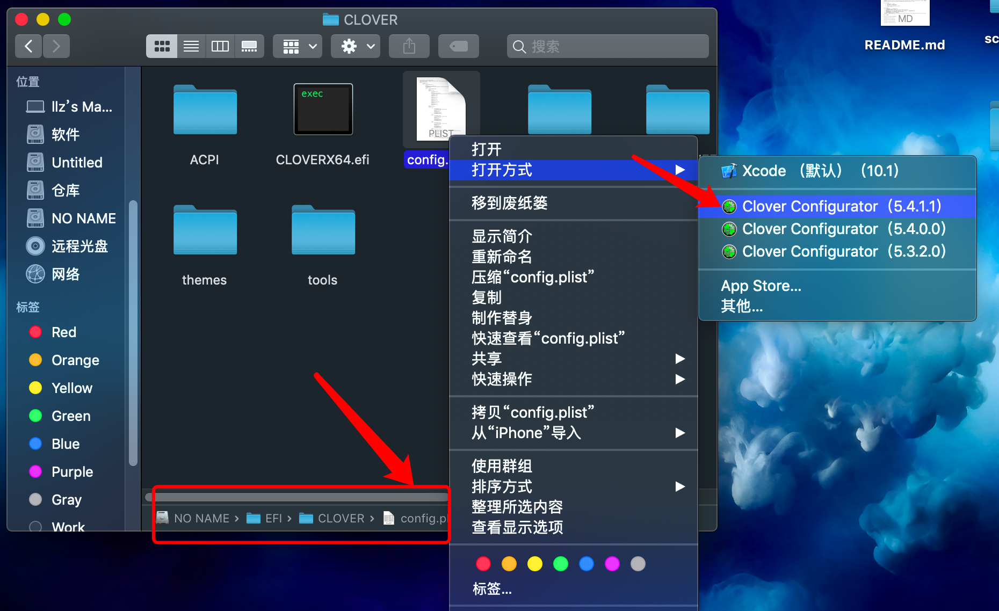
     *   获取UUID  
 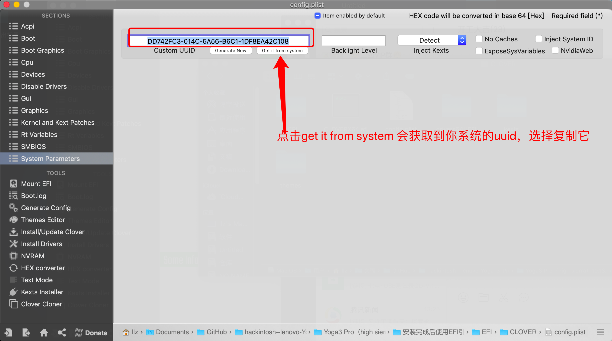
     *  粘贴UUID  
 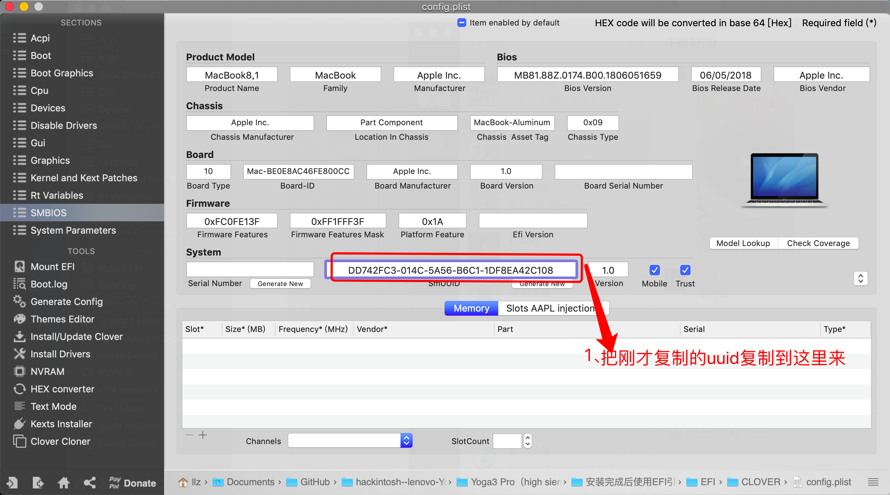
     *  生成自己的SN 
 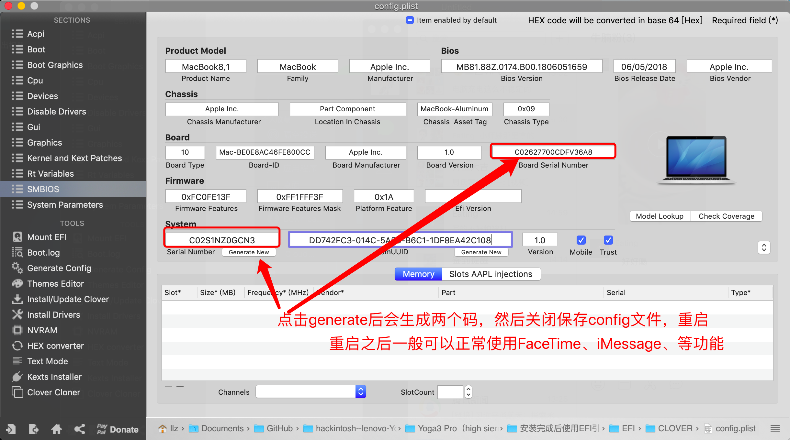
 
 ## 备注：     
 
 *  每个版本都有两个引导，一个安装系统使用，一个是安装系统完成后 重建缓存 更换安装后EFI引导  （重建缓存使用kext utility软件，打开后输入密码，等待重建缓存完成后退出，更换安装后EFI引导）  
 *  如果不识别U盘，请插USB2.0接口（也就是电源口那个usb口）或者检查U盘根目录架构是否是符合EFI读取的要求，如果不懂，请百度 “EFI引导” 。  
 ## 安装完成后触摸板不能使用的方法   
 *  打开访达→左上角选择前往→前往文件夹 进入 /System/Library/Extensions 目录下删除  AppleIntelLpssI2C.kext / AppleIntelLpssI2CController.kext两个文件，重建缓存后重启，syna的目标驱动现在有个bug，就是如果进入了Windows系统，然后再进去mac系统将会不能使用触摸板，唯一解决方法就是多重启两次mac系统。该bug等待以后驱动作者更新版本解决。      

## 五、运行截图  
|:-----:|-----|
|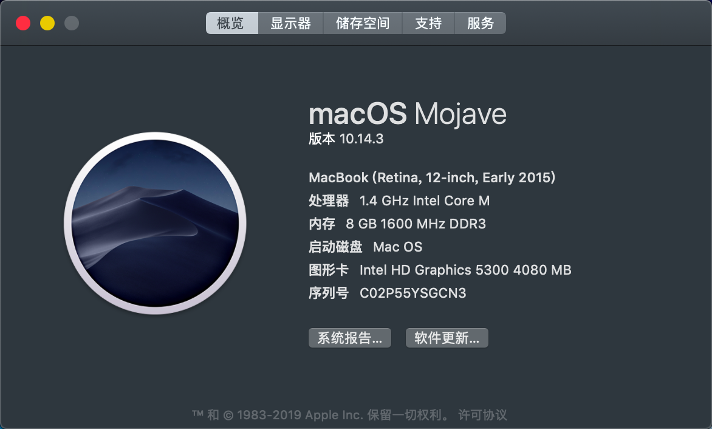|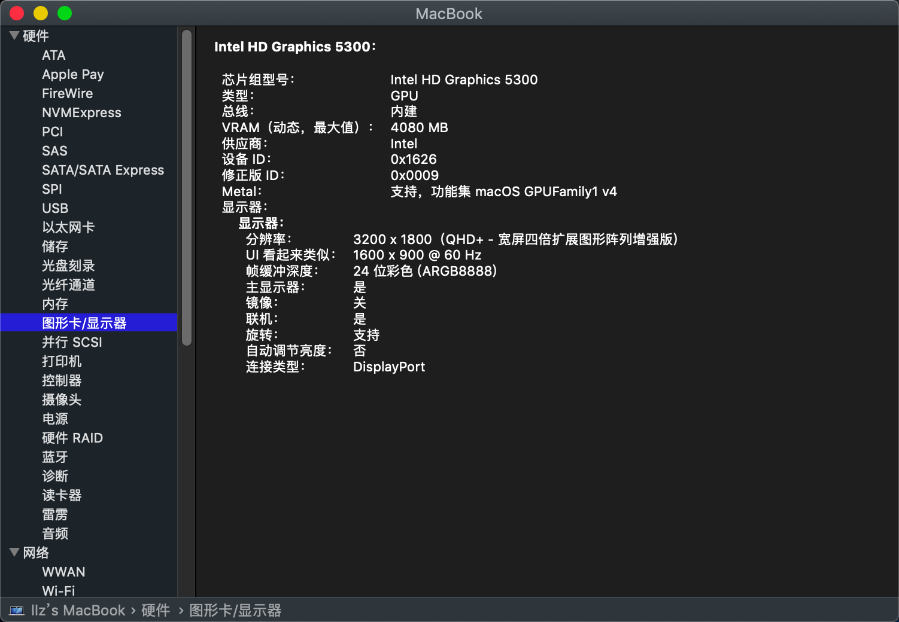|
||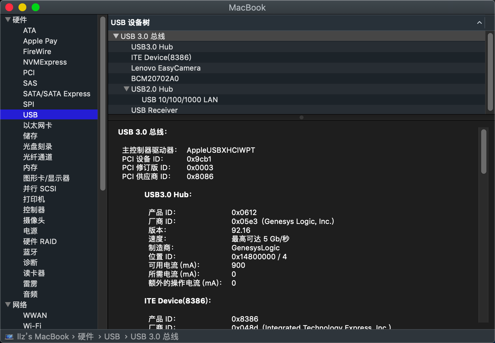|
|||
|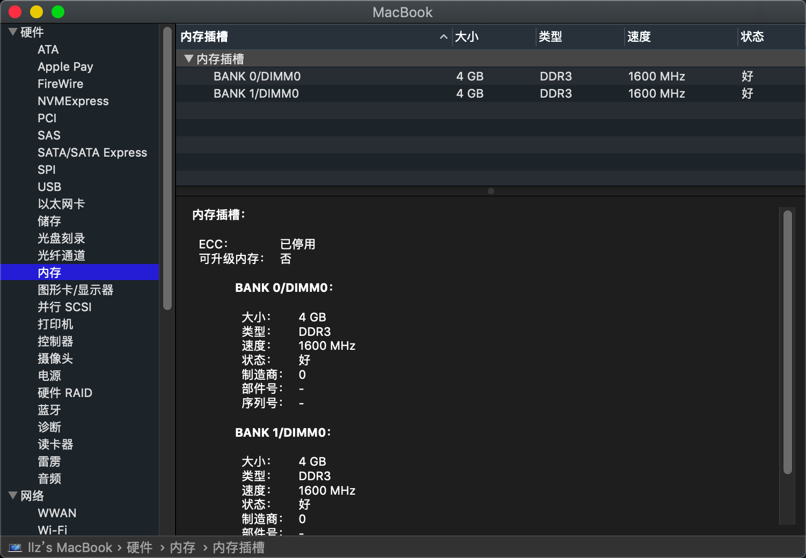||
|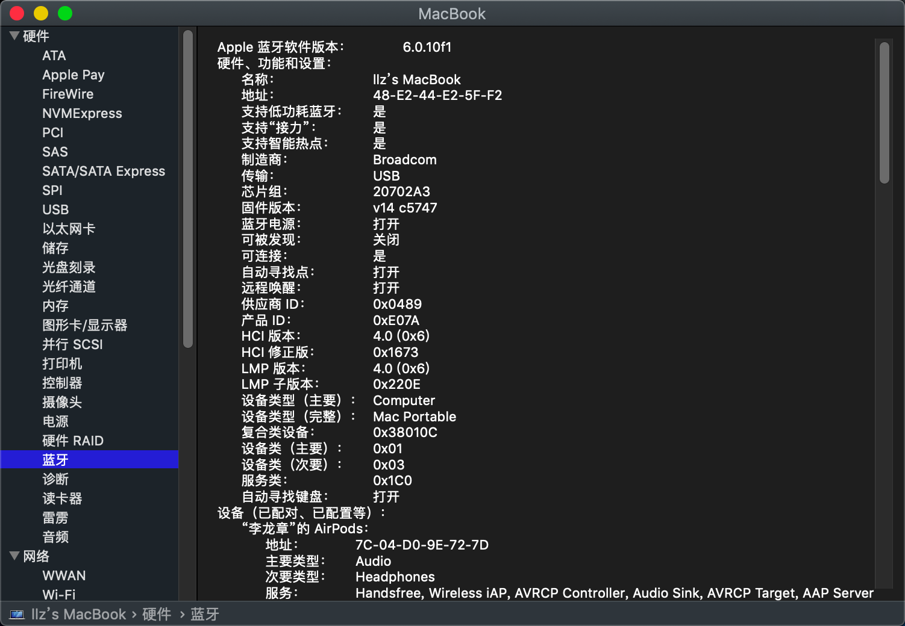|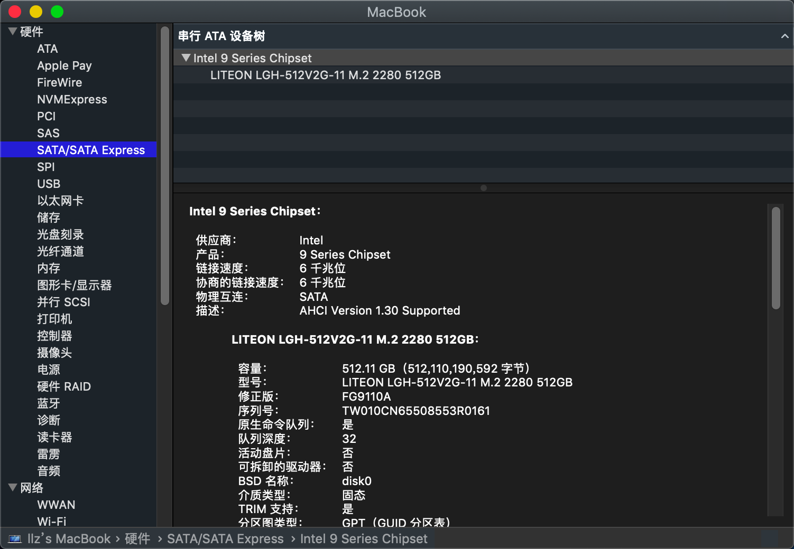|
|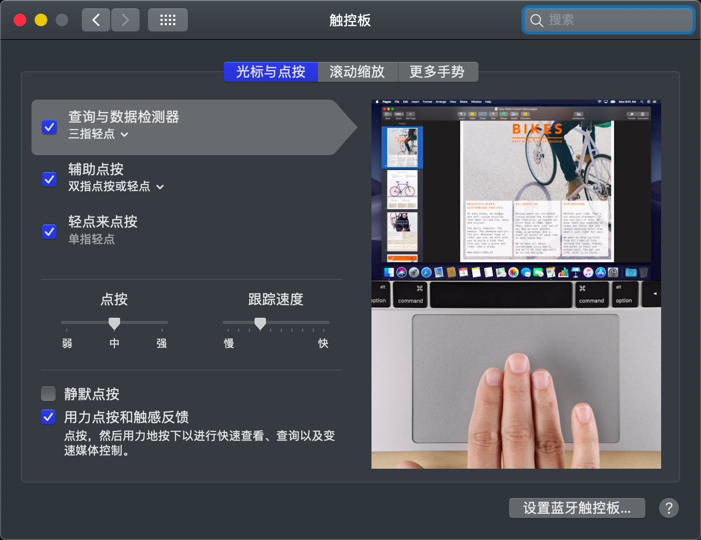|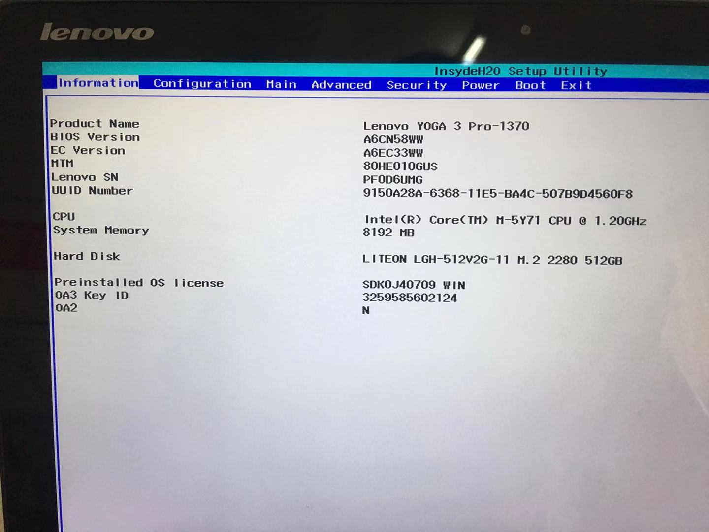|
||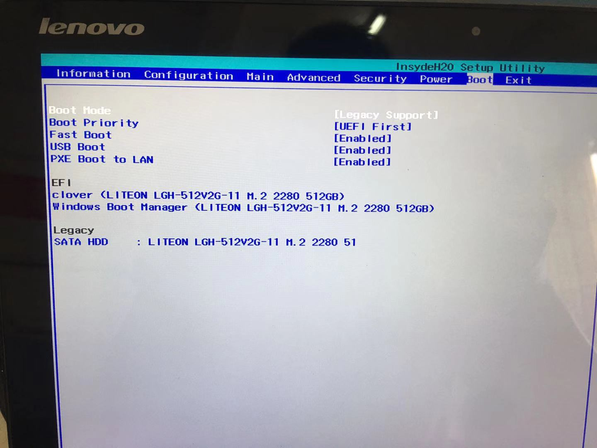|
|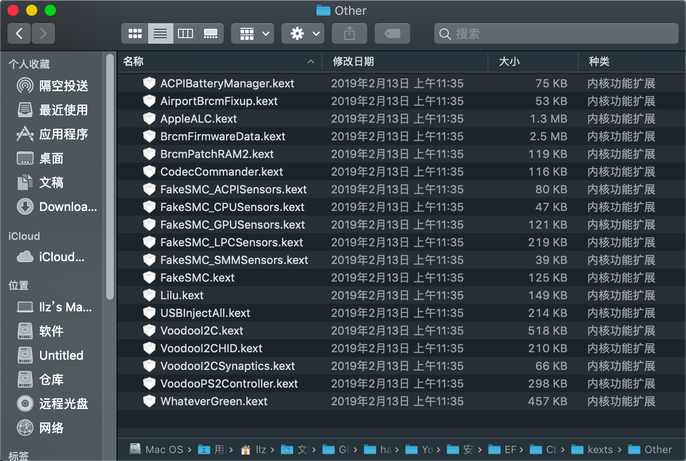|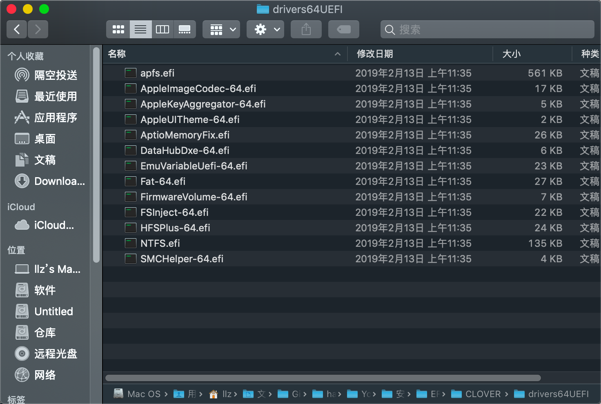|

## 有问题反馈
*  在使用中有任何问题，欢迎反馈给我，可以用以下联系方式跟我交流
* 邮件(gdllzkusi@gmail.com)
* QQ: 374593607  QQ群：778791091
* 如果您认可我的工作，请通过打赏支持我后续的更新
|支付宝|微信|
|:-----:|-----|
| | |
## 感谢  

- [RehabMan](https://github.com/RehabMan) 提供 [AppleBacklightInjector](https://github.com/RehabMan/HP-ProBook-4x30s-DSDT-Patch/tree/master/kexts/AppleBacklightInjector.kext) 和 [EAPD-Codec-Commander](https://github.com/RehabMan/EAPD-Codec-Commander) 和 [OS-X-ACPI-Battery-Driver](https://github.com/RehabMan/OS-X-ACPI-Battery-Driver) 和 [OS-X-Clover-Laptop-Config](https://github.com/RehabMan/OS-X-Clover-Laptop-Config) 和 [OS-X-FakeSMC-kozlek](https://github.com/RehabMan/OS-X-FakeSMC-kozlek) 和 [OS-X-USB-Inject-All](https://github.com/RehabMan/OS-X-USB-Inject-All) 和 [OS-X-Voodoo-PS2-Controller](https://github.com/RehabMan/OS-X-Voodoo-PS2-Controller) 和 [OS-X-BrcmPatchRAM)](https://github.com/RehabMan/OS-X-BrcmPatchRAM) 的维护
- [vit9696](https://github.com/vit9696) 提供 [Lilu](https://github.com/acidanthera/Lilu) 和 [AppleALC](https://github.com/acidanthera/AppleALC) 和 [WhateverGreen](https://github.com/acidanthera/WhateverGreen) 和 [VirtualSMC](https://github.com/acidanthera/VirtualSMC)  和 [VirtualSMC](https://github.com/acidanthera/VirtualSMC) 的维护
- [alexandred](https://github.com/alexandred) 和 [hieplpvip](https://github.com/hieplpvip) 提供 [AirportBrcmFixup](https://github.com/acidanthera/AirportBrcmFixup) 的维护
- [daliansky](https://github.com/daliansky) 和 [penghubingzhou](https://github.com/penghubingzhou) 和 [limurphy](http://i.pcbeta.com/space-uid-2163032.html) 的宝贵建议

